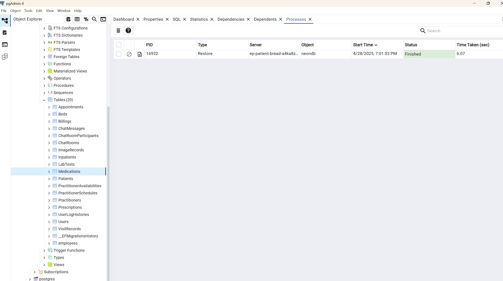

# Eclinic2

This project was generated using [Angular CLI](https://github.com/angular/angular-cli) version 19.2.8.

## Development server

## Breakpoints

middle-size: 768px

## CI/CD, Deployment Automation

- Utilized GitHub Actions workflow for building and testing.
- The project was deployed via Azure static web app. [mini-clinic-online](https://mango-sand-0eb22740f.6.azurestaticapps.net)

## Export && Import data of PostgreSQL

1. I use Docker to run PostgreSQL.
   I have not installed PostgreSQL Client tools on my local machine. So I use the following command to export data from PostgreSQL.
   The backup.sql file is created directly on my local machine, the directory is the current directory where I run the command.
   `docker exec -it your-container-name-or-container-id pg_dump -U username -d database-name > backup.sql`

   ***

2. I use pgAdmin to import data to PostgreSQL.
   Create connection to remote server.
   Right-click on your target database in the browser tree and select "Restore..."
   Data imported successfully.
   

## Server-Client communication approachs

1. SSE (Server-Sent Events)
2. SignalR

## Screenshots

1, login

2, dark mode

3, light mode

4, internationalization

5, data crud

6, chatroom(signalR)

7, responsive UI (big screen)

8, responsive UI (small screen)

9, route guard (Admin role can access admin page)

10, route guard (User role can not access admin page)

11, book appointment

12, check in

13, consultation

14, real-time admission notification via SSE (server-sent events)

15, assign bed

16, deployed as Azure static web app

